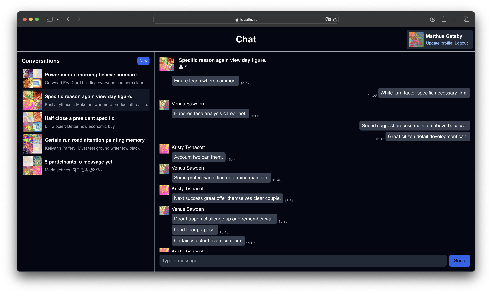
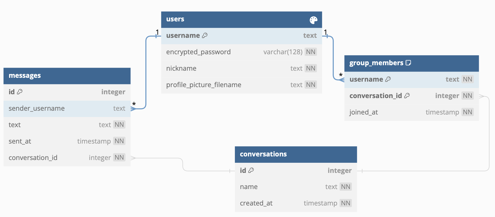

## Chat



|Category|Stack|
|:---:|:---:|
|Front-end|Vue-Js 3 + Vite 4 (Javascript)|
|Backend|Actix-web 4.4 (Rust)|
|Database|SQLite 3, Redis|

```sh
# Clone the repository
git clone https://github.com/stripe2933/chat.git
cd chat

# Start redis at port number 6379
brew services start redis

# Install certificates
mkcert -key-file key.pem -cert-file cert.pem 127.0.0.1 localhost
mkcert -install

# Start server at https://localhost:8443
cd server
cargo run --release

# Start client at https://localhost:5173
cd ../client
npm run dev # client
```

본 프로그램은 유저의 회원가입, 로그인, 회원 정보 수정, 유저 간 채팅 기능을 지원합니다. 성능과 보안성을 염두에 두고 제작되었습니다. 웹서버는 8443, Redis 서버는 6379, 프론트엔드는 5173 포트 번호로 구성됩니다. (실행 시 https://localhost:5173/#/ 으로 접속) HTTPS 보안 연결을 요구하므로 localhost로 발급받은 인증서가 필요합니다 (`mkcert` 이용).

### 구현 상세

- HTTP/2.0 프로토콜을 사용하였으며, Rustls를 이용한 TLS 보안 연결을 지원합니다.
- Websocket을 이용하여 3-way-handshake를 이용한 요청-응답 패턴이 아닌 비동기적으로 메시지 송·수신이 가능합니다.
- 프론트엔드는 Vue-Js의 Composition API를 기반으로 한 SPA로 작성되었으며, vue-router를 이용하여 라우팅됩니다.
- 웹서버는 Rust의 Actix-web 프레임워크를 이용하였으며, 멀티스레딩을 이용하여 요청을 병렬로 처리할 수 있습니다.
- 로그인/대화 목록 로드 등을 구현한 CRUD 기능은 REST API 명명 규칙에 따라 일관적으로 작성되었습니다.
- 웹브라우저 이용 시 CORS(교차 출처 리소스 공유) 정책에 따라 지정된 origin (개발 환경 기준 https://localhost:5173) 에서만 웹 서버에 접근 가능하도록 설정하였습니다.
- 웹서버 내 모든 데이터베이스 쿼리는 비동기적으로 처리되며 (sqlx 사용) 컴파일 시간 prepared statement를 이용하여 SQL injection 공격으로부터 방어됩니다.
- 유저의 비밀번호는 적절한 salt(코드 내 `config.toml` 파일 참조)와 SHA-512 해싱 알고리즘을 이용하여 암호화되어 저장되고, 보안 연결을 통해 서버-클라리언트 간 종단간 암호화됩니다.
- Redis를 사용한 세션 기반 로그인을 지원하며, user-specific한 요청(접속 대화 목록, 송수신된 메시지 등)은 인가된 유저에게만 응답하게끔 설정되었습니다.

### 데이터베이스 구조



네 개의 테이블 (`users`, `conversations`, `messages`, `group_members`)로 구성되었으며, 각 테이블의 연관된 컬럼 간에는 외래키 관계로 연결되어 있습니다. `users`와 `conversations` 테이블은 독립적이며, `messages`와 `group_members`가 이들을 참조하도록 하여 테이블 간 순환 참조를 없앴습니다.

현재는 유저의 탈퇴 기능은 구현되어 있지 않으나, 추후 해당 기능을 구현할 경우 SQLite 3 의 cascade delete를 이용하여 `group_members`의 레코드는 `ON DELETE CASCADE`로, `messages`의 레코드는 `ON DELETE SET NULL`로 하여 외래키 충돌이 발생하지 않도록 구성하였습니다.

### 성능 테스트

환경: Apple M1 Pro (10 Core)

대화 데이터 준비를 위해 Python의 `faker`(mock 데이터 생성)와 `randimage`(유저 프로필 이미지 생성) 모듈을 이용하였습니다.

|Table|Description|
|:---:|:---:|
|`users`|1,000명의 유저를 생성합니다. `username`은 생성 번호 0~999까지로 정해집니다 (e.g. 100번째 유저: `username99`). 비밀번호는 모든 유저가 `Password123`을 지정된 해시 알고리즘으로 암호화되며, `nickname`은 mock 데이터로 생성되었습니다.|
|`conversations`|500개의 채팅방을 생성합니다. `name`은 mock 데이터로 생성, `created_at`은 2023-10-01부터 2023-10-31까지 중 무작위로 설정되었습니다.|
|`group_members`|각 채팅방은 2~10명의 참여자(member)를 갖고, 참여자의 `joined_at`이 해당 채팅방의 `created_at`보다 나중이 되도록 설정합니다. 전체 레코드 개수는 테스트 기준 2,883개입니다.|
|`messages`|`group_members`의 각 대화마다 100회 무작위로 참여자를 선택하여 메시지를 생성합니다. 전체 레코드 개수는 테스트 기준 144,985개입니다.|

Postman을 이용하여 웹서버 REST API를 테스트한 결과는 다음과 같습니다.

- 성능 병목인 접속 대화 목록 + 해당 대화의 마지막 메시지 로드 (`conversations`,`group_members`, `messages` 삼중 JOIN)는 약 245 ms가 소요되었습니다.
- 새로운 대화를 생성하기 위한 모든 유저 프로필 로드는 약 28 ms가 소요되었습니다.
- 그 외, 나머지 요청에 대해서는 거의 네트워크 레이턴시(17 ms)에 가깝게 소요되었습니다.

Python을 이용하여 웹서버 websocket을 테스트한 결과는 다음과 같습니다.
- 8명의 접속자를 가지는 대화에 대해, 한 사람이 메시지를 전송한 후 이를 다른 참여자가 수신하는 데 걸린 시간 소요의 최댓값은 약 30 ms입니다.